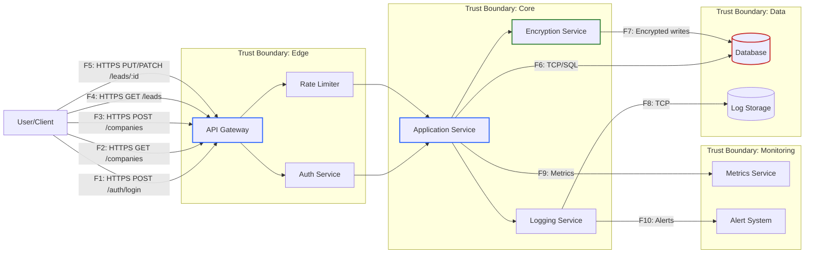

# DFD — Data Flow Diagram

## Описание системы
CRM-система для управления компаниями и лидами с аутентификацией через JWT, rate limiting и шифрованием чувствительных данных.

## Диаграмма потоков данных (Mermaid)

## Список потоков данных

| ID | Откуда → Куда | Канал/Протокол | Данные/PII | Комментарий |
|----|---------------|-----------------|------------|-------------|
| F1 | User → API Gateway | HTTPS | Credentials (username/password) | Аутентификация пользователя, передача JWT токена |
| F2 | User → API Gateway | HTTPS + JWT | Company data (read) | Получение списка компаний, требуется валидный JWT |
| F3 | User → API Gateway | HTTPS + JWT | Company data (write) | Создание компании, rate limit 5/10min |
| F4 | User → API Gateway | HTTPS + JWT | Lead data (read) | Получение списка лидов, rate limit 2/sec |
| F5 | User → API Gateway | HTTPS + JWT | Lead data (write) | Изменение лида, rate limit 5/min |
| F6 | Application Service → Database | TCP/SQL | All business data | Основные операции чтения/записи в БД |
| F7 | Encryption Service → Database | TCP/SQL (encrypted) | Sensitive PII (refresh_tokens) | Шифрование чувствительных данных (AES-256) |
| F8 | Logger → Log Storage | TCP | Logs (errors, security events) | Централизованное логирование |
| F9 | Application Service → Metrics | HTTP/gRPC | Performance metrics | Метрики производительности (latency, RPS) |
| F10 | Logger → Alert System | HTTP/SMTP | Critical alerts | Алерты о критических событиях |

## Границы доверия

### 1. Edge (Граница входа)
- **Компоненты**: API Gateway, Auth Service, Rate Limiter
- **Назначение**: Первая линия защиты, валидация входящих запросов
- **Угрозы**: Spoofing, DDoS, injection attacks

### 2. Core (Ядро приложения)
- **Компоненты**: Application Service, Logger, Encryption Service
- **Назначение**: Бизнес-логика и обработка данных
- **Угрозы**: Authorization bypass, data tampering, information disclosure

### 3. Data (Слой данных)
- **Компоненты**: Database, Log Storage
- **Назначение**: Постоянное хранение данных
- **Угрозы**: Data breach, unauthorized access, data loss

### 4. Monitoring (Мониторинг)
- **Компоненты**: Metrics Service, Alert System
- **Назначение**: Наблюдаемость и реагирование
- **Угрозы**: Alert fatigue, metric manipulation, denial of observability

## Внешние участники

| Участник | Описание | Уровень доверия |
|----------|----------|-----------------|
| User/Client | Конечный пользователь CRM-системы | Не доверенный |
| Admin | Администратор системы | Частично доверенный |
| External Logs/Monitoring | Внешние системы мониторинга | Доверенный (внутренняя инфраструктура) |

## Протоколы и каналы связи

| Канал | Протокол | Шифрование | Аутентификация |
|-------|----------|------------|----------------|
| User → API | HTTPS (TLS 1.2+) | ✅ | JWT Bearer Token |
| API → Services | HTTP/Internal | ⚠️ (internal network) | Service-to-service auth |
| Service → DB | TCP/SQL | ⚠️ (planned: TLS) | DB credentials |
| Service → Logs | TCP | ⚠️ | API key |

## Чувствительные данные (PII)

| Тип данных | Где хранится | Защита | Ссылка на NFR |
|------------|--------------|--------|---------------|
| Credentials (passwords) | Database | Hashing (bcrypt/argon2) | NFR-03 |
| JWT Refresh Tokens | Database | AES-256 encryption | NFR-08 |
| User PII (names, emails) | Database | Access control, encryption at rest | NFR-03, NFR-08 |
| Business data (companies, leads) | Database | Access control, audit logs | NFR-03 |
